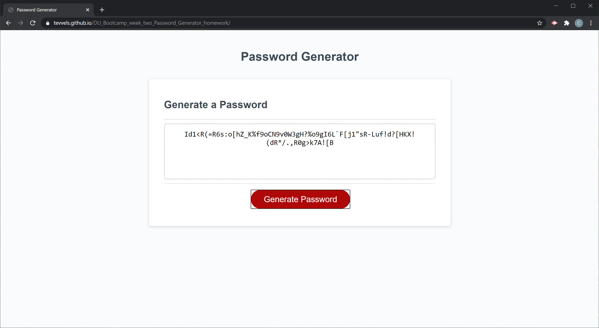

# DU_Bootcamp_week_two_Password_Generator_homework

In this assignment we were tasked to create a password generator.

With more of everyday life transfering onto the internet the need for strong security is now pretty much a given.
Passwords with more complicity are used in preventing unwanted people from gaining access to locations or sites but making these passwords hard or tedious. This is where this app comes in to help our users. With 5 simple questions we can create a very secure password.

The idea was simple.
we grab the users input.  
create a random password with that input.

So first we gathered a length range for the password. this a required question and must contain a specific value for 8 to 128 characters. This is to keep the password to what's roughly the standard size of password inputs.

Then we asked for criteria questions.
Does it contain uppercase letters?
Does it contain lowercase letters?
Does it contain numbers?
Does it contain special characters or symbols?

After we grab the results we then run those answers into a conditional loop which returns random characters that we in turn combine and make the new password.

This was a fun assignment where I got to flex my Javascript muscles and when I was finished all I could think was how I coulda done this code better.

for the live site please visit https://tevvels.github.io/DU_Bootcamp_week_two_Password_Generator_homework/

